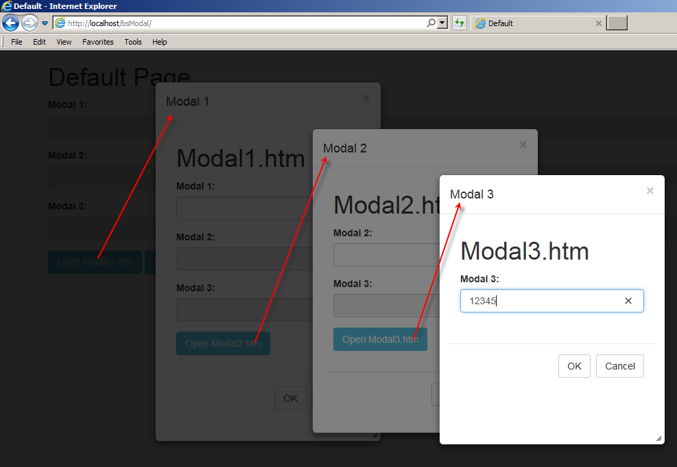

# Resizable and Nested Modal Dialogs using jQuery UI and Bootstrap

Originally posted here:
https://www.codeproject.com/Articles/1158368/Resizable-and-Nested-Modal-Dialogs-using-jQuery-UI

This project will show how to create nested and resizable modals

## Introduction

The goal of this project is to show how to create nested modals that can be resized. Each modal is created from another page using an iframe. This approach lets you dynamically load as many modals as you need. Unzip bsModal.zip to a virtual directory and point your browser to Default.htm.



The code is contained in BsModal.js file. This file will let you:

1. open a URL in a modal dialog using iFrame
2. create nested dialogs
3. show spinner while the page loads
4. open an external page in full screen dialog
5. move the modal dialog around the page
6. resize the modal dialog

The code uses four external libraries:

- jQuery (1.12.3)
- jQuery UI (v1.12.1)
- Bootstrap (3.3.6)
- Font-awesome (4.4.0)

## Background

This article is a sequel to my previous article Nested modal dialogs using Bootstrap. The difference is that this article uses jQuery UI to drag and shows how to resize dialogs.

## Using the Code

To use this code, include BsModal.js file in the page that creates the first dialog. The key function is ShowModal(). It accepts the following parameters:

- sUrl	the URL of the page to be loaded
- iWidth	width of the modal. Optional. When bank window width will be used
- iHeight	height of the modal. Optional. When bank window height will be used
- oWin	windows object of the calling modal page. Optional

From the main page (Default.htm), ShowModal() function can be used like this:

```HTML
 <input type="button" class="btn btn-info" value="Open Modal1.htm" 
  onclick="ShowModal('Modal1.htm',300,430)">
```

From a dialog page, the ShowModal() function can be used like this:

```HTML
 <input type="button" class="btn btn-info" value="Open Modal2.htm" 
  onclick="parent.ShowModal('Modal2.htm',300,350,window)"> 
```

A modal dialog can close by calling HideModal() function like:

```HTML
<button type="button" class="btn btn-default" 
onclick='parent.HideModal()'>Cancel</button> 
```
